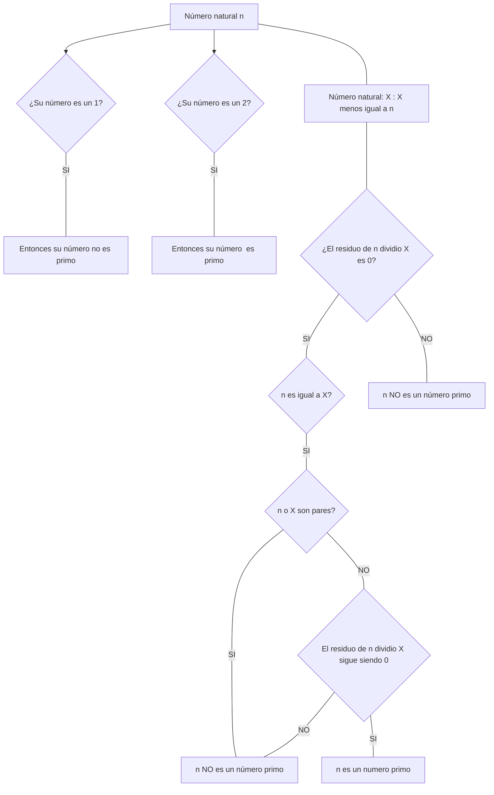

# Reto_3_Juan_Valderrama_CadaVezMasHacker

## Diagrama de flujo para saber si un número tiene raiz exacta o no:


## Ahora, su pseudocódigo quedaria de la siguiente forma.

```

n: Número natural
b: Número natural
a: Número natural

  Escribir ("Ingrese su primer número)
    Leer n

b: Suma de b-1 veces
a: Suma de b-1 veces

  Escribir ("Ingrese su segundo número)
    Leer a

Inicio
Si modulo (n-a = 0) entonces
  Escribir ("La raiz de n es b")

Sino
  si modulo (n-a < 0) entonces
    Escribir (" n NO tiene raiz exacta)

Sino
  b= b+1
    Fin mientras
FIN

```


## Diagrama de flujo para saber si un número es primo o no:



## Y con su respectivo Pseudocódigo quedaria asi:

```

n: Número natural
X: Número natural
X: X</n

Inicio

Inserte n
 leer n

Si
 n: 1 Entonces
  Escrbir("1 No es un número primo)
    Fin mientras
 n:2 Entonces
  Escribir ("2 No es un número primo)
fin mientras

Sino
 si modulo ( n & X = 0)
  mientras n = X and pertenezcan al conjunto de los pares (2n) entonces
   Escribir ("n No es un número primo)
fin mientras

Sino
 si modulo ( n % X = 0) Entonces
  Escribir ("n es un número primo)
fin mientras

Fin

```

## Gracias tkm
 


